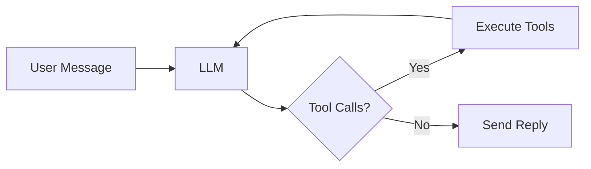

GoGogot

# GoGogot — Lightweight OpenClaw Written in Go

[Go Version](https://go.dev)
[License](LICENSE)
[Stars](https://github.com/aspasskiy/GoGogot/stargazers)
[Lines of code](#)
[Docker](#deployment)

An open-source, self-hosted personal AI agent written in Go. Deploy on your own server as a single ~15 MB binary — it runs shell commands, edits files, browses the web, manages persistent memory, and schedules tasks. A lightweight alternative to OpenClaw (Claude Code) in ~4,500 lines of Go. No frameworks, no plugins, no magic.

## What is GoGogot?

GoGogot is a **lightweight, extensible, and secure** open-source AI agent that lives on your server. It can execute shell commands, read and write files, search and browse the web, maintain persistent memory, and run scheduled tasks. The entire agent is a single Go binary under 15 MB that idles at ~10 MB RAM and deploys with one `docker compose up` command.

### Philosophy

The core philosophy of GoGogot is built around being **lightweight, extensible, and secure**:

- **Lightweight & Containerized**: A single Go binary running inside a Docker container. No heavy frameworks, no complex orchestration. Just a simple eval loop with good tools and smart prompts that consistently outperforms complex frameworks.
- **Secure**: You are fully in control. API keys never leave your server, and the agent runs isolated in a container.
- **Single Model & Cost-Efficiency**: Driven by a single LLM of your choice. You can easily switch to affordable models (like DeepSeek V3.2, Qwen3.5, or MiniMax via OpenRouter) to save costs on routine tasks without sacrificing capability.
- **Extensible**: Clean Go interfaces make it trivial to add new LLM providers, transports, or custom tools.

### How It Works

The entire agent is a `for` loop. No framework, no state machine, no orchestration layer — just call the LLM, execute any tool calls it returns, feed the results back, and repeat until the model has nothing left to do.

Here is a simplified version of the actual [`Run`](agent/run.go) method with logging and bookkeeping stripped away:

```go
func (a *Agent) Run(ctx context.Context, input []ContentBlock) error {
    a.messages = append(a.messages, userMessage(input))

    for {
        resp, err := a.llm.Call(ctx, a.messages, a.tools)
        if err != nil {
            return err
        }
        a.messages = append(a.messages, resp)

        if len(resp.ToolCalls) == 0 {
            break // model is done — send text to user
        }

        results := a.executeTools(resp.ToolCalls)
        a.messages = append(a.messages, results)
    }
    return nil
}
```



That's it. Everything else — memory, scheduling, compaction, identity — is just tools the LLM can call inside this loop.

## Use Cases


| Use Case                  | Example Prompt                                                                              |
| ------------------------- | ------------------------------------------------------------------------------------------- |
| 📰 **Daily Digest**       | Find top 5 AI news from today, summarize each in 2 sentences, send me every morning at 9:00 |
| 📊 **Report Generation**  | Download sales data from this URL, calculate totals by region, generate a PDF report        |
| 📁 **File Processing**    | Take these 12 screenshots, merge them into a single PDF, and send the file back             |
| 🔍 **Market Research**    | Search the web for pricing of competitors X, Y, Z and make a comparison table               |
| 🖥️ **Server Monitoring** | Check disk and memory usage every hour, alert me in Telegram if anything exceeds 80%        |
| 🗃️ **Data Extraction**   | Fetch this webpage, extract all email addresses and phone numbers into a CSV                |
| ⚙️ **Routine Automation** | Every Friday at 18:00, pull this week's git commits and send me a changelog summary         |


## You Are In Control

Everything is configured explicitly via environment variables passed at deploy time. API keys never leave your server — there is no cloud account, no SaaS dashboard, no telemetry, no phoning home.


| Variable             | Purpose                                               |
| -------------------- | ----------------------------------------------------- |
| `ANTHROPIC_API_KEY`  | Claude (direct API)                                   |
| `OPENROUTER_API_KEY` | DeepSeek, Gemini, MiniMax, Qwen, Llama via OpenRouter |
| `GOGOGOT_MODEL`      | Model ID — see table below (default: first available) |
| `TELEGRAM_BOT_TOKEN` | Your Telegram bot                                     |
| `TELEGRAM_OWNER_ID`  | Only this user can talk to the bot                    |
| `BRAVE_API_KEY`      | Web search (optional)                                 |


## Choosing a Model

Set the model via environment variable or CLI flag:

```bash
# Environment variable
GOGOGOT_MODEL=deepseek

# CLI flag (overrides env)
./gogogot --model=gemini
```

If `GOGOGOT_MODEL` is not set, the first available provider is used.

### Built-in Models


| ID         | Model             | Provider   | Context | Vision | Arena Rank | Notes                        |
| ---------- | ----------------- | ---------- | ------- | ------ | ---------- | ---------------------------- |
| `claude`   | Claude Sonnet 4.6 | Anthropic  | 1M      | Yes    | #16        | Best coding, top-3 code rank |
| `deepseek` | DeepSeek V3.2     | OpenRouter | 164K    | No     | #49        | Best cost/quality ratio      |
| `gemini`   | Gemini 3 Pro      | OpenRouter | 1M      | Yes    | #5         | Top-5 overall, multimodal    |
| `minimax`  | MiniMax M2.5      | OpenRouter | 1M      | No     | #75        | Cheap, good for routines     |
| `qwen`     | Qwen3.5 397B A17B | OpenRouter | 262K    | Yes    | #22        | Strong multilingual, vision  |
| `llama`    | Llama 4 Maverick  | OpenRouter | 1M      | Yes    | #160       | Open-source, free tier       |
| `kimi`     | Kimi K2.5         | OpenRouter | 262K    | Yes    | #19        | Top-20 overall, multimodal   |


### Adding Custom Models

Models are defined in `models.json`. Defaults are compiled into the binary, but you can override them by placing your own `models.json` in the data directory (`~/.gogogot/models.json`):

```json
[
  {
    "id": "mythomax",
    "label": "MythoMax 13B (OpenRouter)",
    "model": "gryphe/mythomax-l2-13b",
    "base_url": "https://openrouter.ai/api/v1",
    "api_key_env": "OPENROUTER_API_KEY",
    "format": "openai",
    "context_window": 4096
  }
]
```

Copy an entry, change 3 fields, restart. No recompilation needed. The `api_key_env` field references the environment variable name — keys are passed via environment variables in `docker-compose.yml`, the config is safe to commit.

## Cost

You pick the price/quality tradeoff. All models work out of the box — switch with one env var.


| Model                         | Input (per 1M tokens) | Output (per 1M tokens) | ~Cost per session* |
| ----------------------------- | --------------------- | ---------------------- | ------------------ |
| Llama 4 Maverick              | $0.15                 | $0.60                  | ~$0.01             |
| DeepSeek V3.2                 | $0.25                 | $0.40                  | ~$0.02             |
| MiniMax M2.5 (via OpenRouter) | $0.30                 | $1.10                  | ~$0.03             |
| Qwen3.5 397B A17B             | $0.39                 | $2.34                  | ~$0.04             |
| Kimi K2.5                     | $0.45                 | $2.20                  | ~$0.04             |
| Gemini 3 Pro                  | $1.25                 | $10.00                 | ~$0.16             |
| Claude Sonnet 4.6             | $3.00                 | $15.00                 | ~$0.30             |


 Typical session: ~50K input + ~10K output tokens.

For routine tasks — daily digests, file management, web lookups — DeepSeek V3.2 or MiniMax are more than enough. Switch to Claude or Gemini 3 Pro for complex reasoning when you need it.

## Extensible by Design

No plugin system, no registry, no framework. Just Go interfaces and a JSON config.

### Adding a model (no code changes)

Any OpenAI-compatible or Anthropic-compatible API works out of the box. Add an entry to `models.json`, set the `format` field, restart:

- `"format": "openai"` — OpenRouter, Together, Fireworks, any OpenAI-compatible endpoint
- `"format": "anthropic"` — Anthropic direct API or compatible proxies

See [Adding Custom Models](#adding-custom-models) above for the JSON schema.

### Adding a new LLM backend (code)

If you need a non-OpenAI, non-Anthropic wire format, implement the `Backend` interface — one method:

```go
type Backend interface {
    Call(ctx context.Context, model string, systemPrompt string,
        messages []types.Message, tools []types.ToolDef, maxTokens int,
    ) (*types.Response, error)
}
```

Then register it in `llm/client.go`:

```go
case "myformat":
    backend = mypkg.NewBackend(p.BaseURL, p.APIKey)
```

Ships with: **Anthropic** (native SDK) and **OpenAI-compatible** (OpenRouter, etc.).

### Adding a new transport (code)

Implement `Transport` — 3 methods:

```go
type Transport interface {
    Name() string
    Run(ctx context.Context, handler Handler) error
    SendText(ctx context.Context, channelID string, text string) error
}
```

Optionally implement `FileSender`, `TypingNotifier`, `StatusUpdater` for richer UX (file uploads, typing indicators, editable status messages).

Then add a case in `cmd/main.go`:

```go
case "discord":
    return discord.New(cfg.DiscordToken)
```

Ships with: **Telegram**. Want Discord, Slack, or Matrix? Implement 3 methods and plug it in.

## Features

- **Telegram** — multi-chat, attachments (images, documents), typing indicators
- **System access** — bash, read/write/edit files, system info
- **Web** — search (Brave), fetch pages, HTTP requests, download files
- **Identity** — persistent `soul.md` (agent personality) and `user.md` (owner profile), auto-evolving through conversations
- **Memory** — persistent markdown files the agent reads and writes itself
- **Skills** — reusable procedural knowledge the agent creates and consults itself
- **Task planning** — session-scoped checklist for multi-step work
- **Scheduling** — cron-based self-scheduling, persisted across restarts
- **Compaction** — automatic context compression when approaching token limits
- **Multi-model** — 7 built-in models (Claude Sonnet 4.6, DeepSeek V3.2, Gemini 3 Pro, MiniMax M2.5, Qwen3.5, Llama 4, Kimi K2.5), add your own via `models.json`
- **Observability** — structured event system (LLM calls, tool executions, errors)

## Tools

27 built-in tools across 10 categories: shell, files, web, identity, memory, skills, system info, scheduling, transport, and task planning.

The LLM sees the full tool list and picks the right one for the job.

## Installation & Quick Start

### Prerequisites

- Get a `TELEGRAM_BOT_TOKEN` by creating a new bot via [@BotFather](https://t.me/BotFather) on Telegram.
- Find your `TELEGRAM_OWNER_ID` (your personal Telegram user ID) using a bot like [@userinfobot](https://t.me/userinfobot). **This is critical for security** — it ensures only you can communicate with your agent.

### Docker Deployment

```bash
git clone https://github.com/aspasskiy/GoGogot.git
cd GoGogot

# Configure — set env vars directly or export them before running
export TELEGRAM_BOT_TOKEN=...
export TELEGRAM_OWNER_ID=...
export ANTHROPIC_API_KEY=...       # or OPENROUTER_API_KEY

# Run
docker compose -f deploy/docker-compose.yml up -d
```

The Docker image ships with a full Ubuntu environment: bash, git, Python, Node.js, ripgrep, sqlite, postgresql-client, and more.

### Local Development

To run the agent locally without Docker (requires Go 1.25+):

```bash
go run cmd/main.go
```

## Minimum Dependencies

- **Go 1.25** — compiled, concurrent, zero-dependency runtime
- [anthropic-sdk-go](https://github.com/anthropics/anthropic-sdk-go) — native Claude API
- [openai-go](https://github.com/openai/openai-go) — OpenRouter / OpenAI-compatible providers
- [telegram-bot-api](https://github.com/go-telegram-bot-api/telegram-bot-api) — Telegram transport
- [robfig/cron](https://github.com/robfig/cron) — scheduler
- [goldmark](https://github.com/yuin/goldmark) — markdown parsing
- [goquery](https://github.com/PuerkitoBio/goquery) — HTML parsing for web tools
- [zerolog](https://github.com/rs/zerolog) — structured logging

## License

MIT